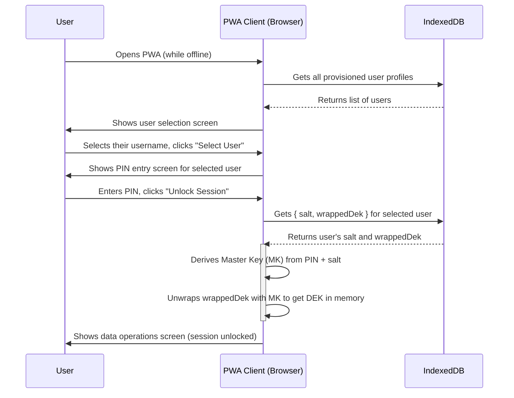

```mermaid
sequenceDiagram
    participant User
    participant PWA Client (Browser)
    participant IndexedDB

    User->>PWA Client (Browser): Opens PWA (while offline)
    PWA Client (Browser)->>IndexedDB: Gets all provisioned user profiles
    IndexedDB-->>PWA Client (Browser): Returns list of users

    PWA Client (Browser)->>User: Shows user selection screen
    User->>PWA Client (Browser): Selects their username, clicks "Select User"

    PWA Client (Browser)->>User: Shows PIN entry screen for selected user
    User->>PWA Client (Browser): Enters PIN, clicks "Unlock Session"

    PWA Client (Browser)->>IndexedDB: Gets { salt, wrappedDek } for selected user
    IndexedDB-->>PWA Client (Browser): Returns user's salt and wrappedDek

    activate PWA Client (Browser)
    PWA Client (Browser)->>PWA Client (Browser): Derives Master Key (MK) from PIN + salt
    PWA Client (Browser)->>PWA Client (Browser): Unwraps wrappedDek with MK to get DEK in memory
    deactivate PWA Client (Browser)

    PWA Client (Browser)->>User: Shows data operations screen (session unlocked)
```
