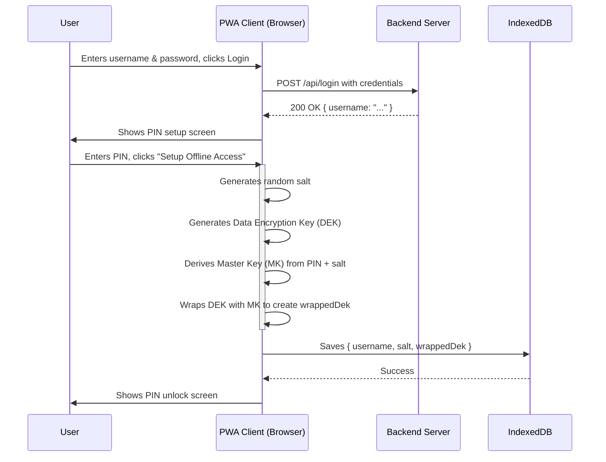

```mermaid
sequenceDiagram
participant User
participant PWA Client (Browser)
participant Backend Server
participant IndexedDB

    User->>PWA Client (Browser): Enters username & password, clicks Login
    PWA Client (Browser)->>Backend Server: POST /api/login with credentials
    Backend Server-->>PWA Client (Browser): 200 OK { username: "..." }

    PWA Client (Browser)->>User: Shows PIN setup screen
    User->>PWA Client (Browser): Enters PIN, clicks "Setup Offline Access"

    activate PWA Client (Browser)
    PWA Client (Browser)->>PWA Client (Browser): Generates random salt
    PWA Client (Browser)->>PWA Client (Browser): Generates Data Encryption Key (DEK)
    PWA Client (Browser)->>PWA Client (Browser): Derives Master Key (MK) from PIN + salt
    PWA Client (Browser)->>PWA Client (Browser): Wraps DEK with MK to create wrappedDek
    deactivate PWA Client (Browser)

    PWA Client (Browser)->>IndexedDB: Saves { username, salt, wrappedDek }
    IndexedDB-->>PWA Client (Browser): Success

    PWA Client (Browser)->>User: Shows PIN unlock screen
```
