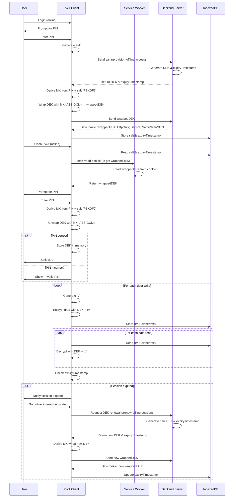

```mermaid

sequenceDiagram

participant User
participant PWA_Client as PWA Client
participant ServiceWorker as Service Worker
participant Backend as Backend Server
participant IndexedDB

    %% Flow 1: Initial Online Provisioning and PIN Setup
    User->>PWA_Client: Login (online)
    PWA_Client->>User: Prompt for PIN
    User->>PWA_Client: Enter PIN
    PWA_Client->>PWA_Client: Generate salt
    PWA_Client->>Backend: Send salt (/provision-offline-access)
    Backend->>Backend: Generate DEK & expiryTimestamp
    Backend-->>PWA_Client: Return DEK & expiryTimestamp
    PWA_Client->>PWA_Client: Derive MK from PIN + salt (PBKDF2)
    PWA_Client->>PWA_Client: Wrap DEK with MK (AES-GCM) → wrappedDEK
    PWA_Client->>Backend: Send wrappedDEK
    Backend-->>PWA_Client: Set-Cookie#58; wrappedDEK#59; HttpOnly#59; Secure#59; SameSite=Strict
    PWA_Client->>IndexedDB: Store salt & expiryTimestamp

    %% Flow 2: Offline Data Access (Session Unlock)
    User->>PWA_Client: Open PWA (offline)
    PWA_Client->>IndexedDB: Read salt & expiryTimestamp
    PWA_Client->>ServiceWorker: Fetch /read-cookie (to get wrappedDEK)
    ServiceWorker->>ServiceWorker: Read wrappedDEK from cookie
    ServiceWorker-->>PWA_Client: Return wrappedDEK
    PWA_Client->>User: Prompt for PIN
    User->>PWA_Client: Enter PIN
    PWA_Client->>PWA_Client: Derive MK from PIN + salt (PBKDF2)
    PWA_Client->>PWA_Client: Unwrap DEK with MK (AES-GCM)
    alt PIN correct
        PWA_Client->>PWA_Client: Store DEK in memory
        PWA_Client->>User: Unlock UI
    else PIN incorrect
        PWA_Client->>User: Show "Invalid PIN"
    end

    %% Data Operations
    loop For each data write
        PWA_Client->>PWA_Client: Generate IV
        PWA_Client->>PWA_Client: Encrypt data with DEK + IV
        PWA_Client->>IndexedDB: Store (IV + ciphertext)
    end
    loop For each data read
        PWA_Client->>IndexedDB: Read (IV + ciphertext)
        PWA_Client->>PWA_Client: Decrypt with DEK + IV
    end

    %% Flow 3: Offline Session Expiry and Renewal
    PWA_Client->>PWA_Client: Check expiryTimestamp
    alt Session expired
        PWA_Client->>User: Notify session expired
        User->>PWA_Client: Go online & re-authenticate
        PWA_Client->>Backend: Request DEK renewal (/renew-offline-session)
        Backend->>Backend: Generate new DEK & expiryTimestamp
        Backend-->>PWA_Client: Return new DEK & expiryTimestamp
        PWA_Client->>PWA_Client: Derive MK, wrap new DEK
        PWA_Client->>Backend: Send new wrappedDEK
        Backend-->>PWA_Client: Set-Cookie: new wrappedDEK
        PWA_Client->>IndexedDB: Update expiryTimestamp
    end
```
