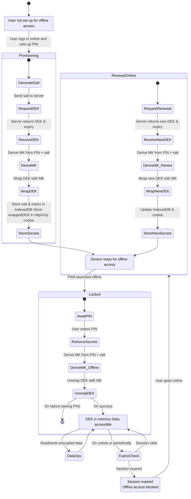

```mermaid
stateDiagram-v2
[*] --> Unprovisioned

    Unprovisioned: User not set up for offline access

    Unprovisioned --> Provisioning : User logs in online and sets up PIN

    state Provisioning {
        [*] --> GenerateSalt
        GenerateSalt --> RequestDEK : Send salt to server
        RequestDEK --> ReceiveDEK : Server returns DEK & expiry
        ReceiveDEK --> DeriveMK : Derive MK from PIN + salt
        DeriveMK --> WrapDEK : Wrap DEK with MK
        WrapDEK --> StoreSecrets : Store salt & expiry in IndexedDB Store wrappedDEK in HttpOnly cookie
        StoreSecrets --> Provisioned
    }

    Provisioned: Device ready for offline access

    Provisioned --> Locked : PWA launched offline

    state Locked {
        [*] --> AwaitPIN
        AwaitPIN --> RetrieveSecrets : User enters PIN
        RetrieveSecrets --> DeriveMK_Offline : Derive MK from PIN + salt
        DeriveMK_Offline --> UnwrapDEK : Unwrap DEK with MK
        UnwrapDEK --> [*] : On failure (wrong PIN)
        UnwrapDEK --> SessionActive : On success
    }

    SessionActive: DEK in memory Data accessible

    SessionActive --> DataOps : Read/write encrypted data

    DataOps --> SessionActive

    SessionActive --> ExpiryCheck : On unlock or periodically

    ExpiryCheck --> SessionActive : Session valid
    ExpiryCheck --> Expired : Session expired

    Expired: Session expired<br>Offline access blocked

    Expired --> RenewalOnline : User goes online

    state RenewalOnline {
        [*] --> RequestRenewal
        RequestRenewal --> ReceiveNewDEK : Server returns new DEK & expiry
        ReceiveNewDEK --> DeriveMK_Renew : Derive MK from PIN + salt
        DeriveMK_Renew --> WrapNewDEK : Wrap new DEK with MK
        WrapNewDEK --> StoreNewSecrets : Update IndexedDB & cookie
        StoreNewSecrets --> Provisioned
    }
```
